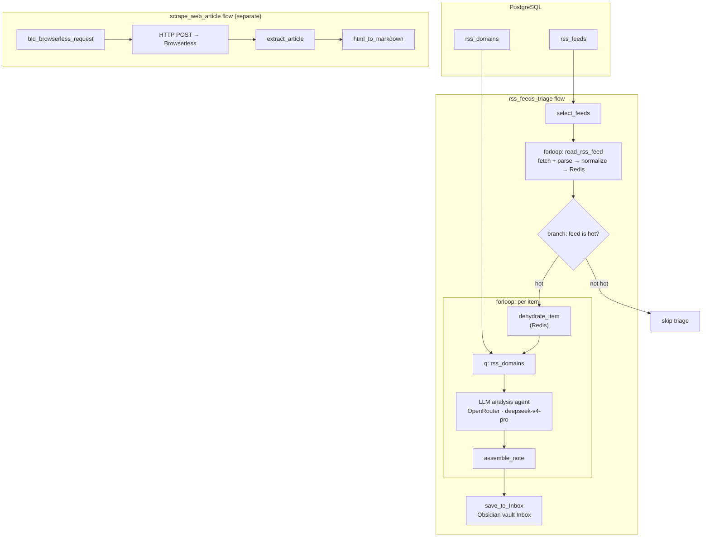

# obsidian-agents

**Windmill-powered AI agents that mine, filter, and enrich RSS feeds — surfacing high-signal content for Obsidian.**

[](./LICENSE)
[](https://bun.sh)
[](https://windmill.dev)

---

## Architecture



- **`select_feeds`** → queries `rss_feeds` for feeds + last-scan state
- **`read_rss_feed`** → fetches & parses RSS via `@extractus/feed-extractor`, enriches with images/media/authors/tags, stores items in **Redis**, returns a flyweight feed descriptor
- **`dehydrate_item`** → rehydrates a full item from Redis by handle
- **`q`** → loads subject-matter domains from `rss_domains`
- **LLM analysis agent** (OpenRouter, `deepseek/deepseek-v4-pro`) → scores each item on 5 axes (actionability, novelty, impact, rigor, depth), domain relevance, highlights, expiry
- **`assemble_note`** → computes a weighted reading value and renders a Markdown note with frontmatter
- **`save_to_Inbox`** → writes the note into the Obsidian vault's `Inbox` folder
- **`scrape_web_article` flow** (separate) → full-text article scraping via **Browserless** (`bld_browserless_request` → HTTP POST → `extract_article` → `html_to_markdown`)

---

## Project Structure

```
.
├── wmill.yaml                  # Windmill CLI config (Bun runtime, sync rules)
├── wmill-lock.yaml             # Content-hash lockfile for sync integrity
├── tsconfig.json               # TS config (extends tsconfig.wmill.json)
├── tsconfig.wmill.json         # Windmill-managed TS paths & settings
├── rt.d.ts                     # Windmill resource-type declarations
├── AGENTS.md                   # AI agent instructions (user-owned)
├── AGENTS.wmill.md             # Windmill-managed agent guidance
│
├── f/lib/                      # Shared library scripts
│   ├── read_rss_feed.ts        # Core: RSS fetch + parse + Redis cache
│   ├── html_to_markdown.ts     # HTML → Markdown conversion
│   └── save_to_Inbox.ts        # Write note into Obsidian vault Inbox
│
└── u/peterernst/
    ├── rss_feeds_triage/       # Feed-mining pipeline scripts
    │   ├── select_feeds.pg.sql # Select feeds from DB
    │   ├── select_hot_feeds.pg.sql # Select "hot" feeds variant
    │   ├── download_policy.pg.sql  # Per-feed scrape policy lookup
    │   ├── q.pg.sql            # Select subject-matter domains
    │   ├── dehydrate_item.ts   # Rehydrate item from Redis by handle
    │   └── assemble_note.ts    # Score + render Markdown note
    │
    ├── rss_feeds_triage__flow/ # Orchestration flow
    │   └── flow.yaml           # Flow DAG: select → forloop → read → LLM → Inbox
    │
    ├── scrape_web_article/     # Full-text article scraping
    │   ├── extract_article.ts  # Parse Browserless response
    │   └── scrape_web_article__flow/  # Browserless → extract → markdown
    │
    ├── bld_browserless_request.ts  # Build Browserless scrape request
    ├── openai_windmill.resource.yaml    # OpenAI API key resource
    ├── openrouter_windmill.resource.yaml# OpenRouter API key resource
    └── openrouter_windmill.variable.yaml# OpenRouter token (secret)
```

---

## Key Design Decisions

| Decision | Rationale |
|---|---|
| **Bun runtime** | Faster cold starts, native TS, better `feed-extractor` compat than Deno |
| **`@extractus/feed-extractor`** | Handles RSS 2.0, Atom, RSS 1.0; normalizes to uniform `FeedData` |
| **Custom `IFeed`/`IItem` interfaces** | Extends `FeedEntry` with `tags`, `authors`, `image`, `media[]`, `content` |
| **Redis as item store** | Full item bodies cached in Redis; flow passes lightweight flyweight feed descriptors + handles |
| **Forloop + `skip_failures: true`** | One bad feed won't kill the batch; partial results preserved |
| **`branchone` on hot feeds** | Only feeds flagged "hot" get the full LLM triage treatment |
| **LLM analysis agent** | OpenRouter `deepseek/deepseek-v4-pro` scores items on 5 axes + domain relevance with structured JSON output |
| **OpenRouter as LLM gateway** | Multi-model access (GPT-4, Claude, Gemini) through one API key |
| **Windmill secrets for credentials** | API keys stored as Windmill secrets, never synced to git (`skipSecrets: true`) |
| **Browserless for full-text** | Headless Chrome scraping (`scrape_web_article` flow) for articles missing full content in the feed |

---

## Quick Start

```powershell
# Install Windmill CLI & deps
npm install
npx windmill init

# Pull latest from Windmill workspace
npx windmill sync pull

# Push local changes to Windmill
npx windmill sync push

# Run the rss_feeds_triage flow locally
npx windmill flow run u/peterernst/rss_feeds_triage
```

### Prerequisites

- **Windmill workspace** (self-hosted or cloud) with a PostgreSQL resource named `rss`
- **`rss_feeds` table** with columns: `id`, `name`, `feed_url`, `item_limit`, `last_scan`, `scrape_article`, `feed_data`
- **`rss_domains` table** with subject-matter domains + tags for LLM relevance scoring
- **Redis** reachable at `redis://redis:6379` for item caching
- **OpenRouter** resource configured in Windmill (LLM analysis agent)

---

## Flow: `rss_feeds_triage`

1. **`select_feeds`** — `SELECT id, name, feed_url, item_limit, last_scan FROM rss_feeds` (PostgreSQL rawscript)
2. **Forloop over feeds** — each feed → `f/lib/read_rss_feed` (fetch, parse, normalize, cache items in Redis)
   - `parallel: false`, `skip_failures: true`
3. **`branchone` — "Feed is hot"** — for hot feeds, forloop over items:
   - **`dehydrate_item`** — rehydrate full item from Redis by handle
   - **`q`** — load subject-matter domains from `rss_domains`
   - **LLM analysis agent** — OpenRouter `deepseek/deepseek-v4-pro`, structured JSON output (highlights, domain_relevance, reading_values, analyst_notes, expires)
   - **`assemble_note`** — weighted reading value + Markdown note with frontmatter
   - **`save_to_Inbox`** — write note to Obsidian vault `Inbox`

### Script: `read_rss_feed`

| Input | Type | Description |
|---|---|---|
| `id` | `number` | Feed row ID |
| `feed_name` | `string` | Feed display name |
| `feed_url` | `string` | RSS/Atom feed URL |
| `item_limit` | `number` | Max items to return |
| `last_scan` | `string` | ISO timestamp for incremental fetch |
| `short_content` | `boolean` | Whether feed items are short (truncated) |

Returns: a flyweight `IFlyweightFeed` descriptor (title, site, tags, `item_handles[]` pointing into Redis) — full `IItem[]` bodies live in Redis.

---

## Roadmap

- [x] **LLM scoring module** — score/rank items via OpenRouter; keep only high-signal
- [x] **Obsidian sink** — write filtered items as Markdown notes to an Obsidian vault
- [x] **Browserless fetch** — headless article scraping for full-text extraction
- [ ] **Scheduled trigger** — cron-based periodic feed mining
- [ ] **Tag classification** — LLM auto-tagging of items by topic/domain
- [ ] **Deduplication** — cross-feed duplicate detection via embedding similarity
- [ ] **Hot-feed detection** — automate the `branchone` "feed is hot" decision instead of manual flags

---

## License

MIT © 2026 Peter Ernst ([WetHat](https://github.com/WetHat))