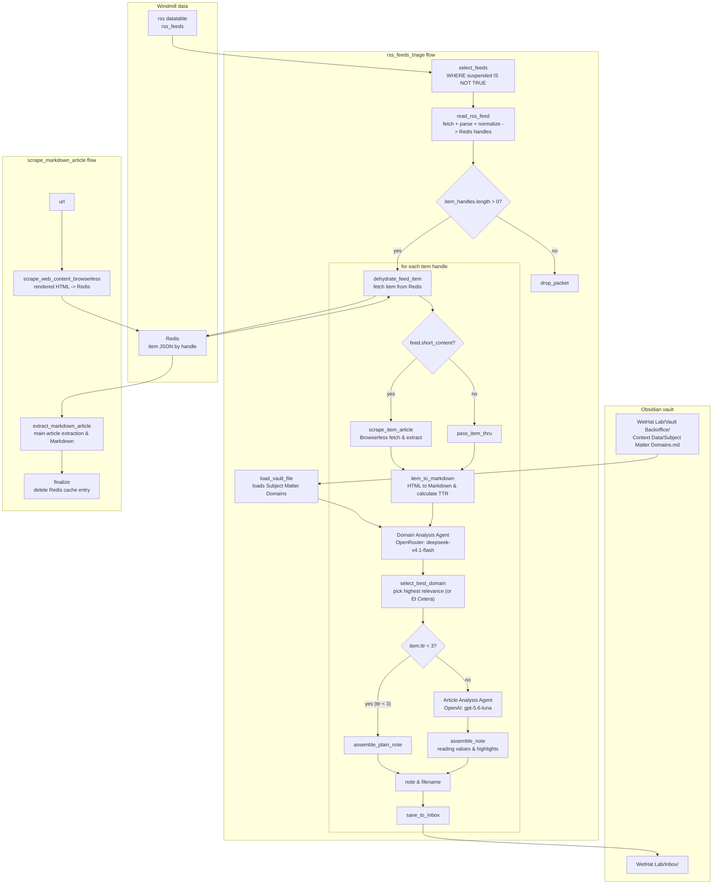

# obsidian-agents

**Windmill workflows that collect RSS items, score their reading value, and write useful articles into an Obsidian vault.**

[](https://bun.sh)
[](https://windmill.dev)

## What Is Here

The main workflow is `u/peterernst/rss_feeds_triage`. It reads active feed definitions from the Windmill `rss` datatable, parses and normalizes items, caches them in Redis, runs two-stage AI analysis (Domain Relevance via OpenRouter DeepSeek V4.1 Flash, followed by Reading Value analysis via OpenAI GPT-5.6 Luna), and writes the resulting Markdown note into the `WetHat Lab` vault Inbox. Short-content feeds have their full articles scraped via Browserless prior to analysis, and short items below reading time thresholds are saved as plain notes without invoking the reading value model.

A second production flow, `u/peterernst/scrape_markdown_article`, scrapes a single web page via a self-hosted Browserless service, extracts clean Markdown, and cleans up the Redis cache. The repository also includes note assembly and vault saving scripts for inbox integration.

The repository also contains reusable vault, Markdown, RSS, Redis, and Browserless scripts, Docker service definitions (Windmill, Redis Stack, Browserless), plus regression-test flows for RSS parsing and article scraping. The `scrape_web_article` flow directories are placeholders for a planned orchestration flow; the working scrape pipeline is `scrape_markdown_article`.

## Architecture



### Production flow (`rss_feeds_triage`)

1. `select_feeds` runs `SELECT * FROM rss_feeds WHERE suspended IS NOT TRUE` against the `rss` datatable.
2. `load_vault_file` reads `Subject Matter Domains.md` from `WetHat Lab/Vault Backoffice/Context Data`; the file contents become the domain taxonomy in the Domain Analysis Agent's system prompt.
3. The outer loop iterates over the feed records sequentially (skipping failed feeds).
4. For each feed, `read_rss_feed` fetches and parses RSS or Atom with `@extractus/feed-extractor`, normalizes authors, tags, images, media, links, and content, filters items newer than `last_scan` (or drops already seen items matching `last_item_id`), stores full item objects in Redis under `web_<feed_id>_<item_index>`, updates `last_scan` and `last_item_id` in the `rss_feeds` table, and returns a lightweight feed descriptor with `item_handles`.
5. Feeds with no new items (`item_handles.length == 0`) branch to `drop_packet`, a no-op sink.
6. Feeds with `item_handles.length > 0` process items sequentially (skipping failed items):
   - **Rehydration**: `dehydrate_feed_item` retrieves the full item JSON object from Redis using the handle.
   - **Content expansion**: If `feed.short_content` is true, `scrape_item_article` fetches the full article via Browserless, extracts the main article content, and updates the item content and `ttr`. Otherwise, `pass_item_thru` passes the item unchanged.
   - **Markdown conversion**: `item_to_markdown` converts item HTML into clean Markdown and estimates reading time (`ttr` in minutes) if not already set.
   - **Stage 1 AI (Domain Analysis)**: An AI agent (`deepseek/deepseek-v4.1-flash` via OpenRouter using resource `$res:u/peterernst/openrouter_api_key`) evaluates the article against all configured subject matter domains and outputs structured domain relevance scores (`0..100`) and analyst notes.
   - **Domain selection**: `select_best_domain` picks the domain with highest relevance. If the top relevance is $\le 50$, the domain falls back to `'Et Cetera'` with an inverted score (`100 - relevance`).
   - **Stage 2 AI or Plain Note**:
     - If estimated reading time `ttr < 3`, `assemble_plain_note` formats a clean note without running the reading value model.
     - If `ttr >= 3`, the **Article Analysis Agent** (`gpt-5.6-luna` via OpenAI using resource `$res:u/peterernst/openai_api_key`) scores five reading-value axes (`actionability`, `novelty`, `impact`, `rigor`, `depth` from `0` to `3`), extracts key highlights, sets an expiration date, and records analyst notes. `assemble_note` calculates a weighted reading score with high-value boosts, renders frontmatter indicators (`⭕`, `⭐`, `⭐⭐`, `⭐⭐⭐`), TL;DR callout, highlights, reading value table, analyst notes, and media embeds.
   - **Vault export**: `save_to_Inbox` sanitizes the filename and saves the Markdown note under `/mnt/obsidianvaults/WetHat Lab/Inbox`.

### Scrape flow (`scrape_markdown_article`)

1. `scrape_web_content_browserless` renders the page in Browserless (with stealth mode and ad-network request blocking) and stores the rendered `head` and `body` HTML in Redis under the source URL.
2. `extract_markdown_article` reads the cached HTML from Redis (resolving the Redis connection via `f/lib/redis_client_url`), cleans and sanitizes custom and code tags with LinkeDOM, extracts the main article with `@extractus/article-extractor`, extracts and backfills metadata (OpenGraph, Twitter, Dublin Core, Marfeel, standard meta), and converts the article to Markdown with `@xberg-io/html-to-markdown`.
3. `finalize` deletes the Redis cache entry for the source URL and returns the extracted article object.
4. (Optional note assembly): `u/peterernst/scrape_markdown_article/assemble_note` can be used to format the article with frontmatter and an `[!intro]+` callout for saving to the vault Inbox via `f/lib/save_to_Inbox`.

### Schedules

The `rss_feeds_triage` schedule (`u/peterernst/rss_feeds_triage.schedule.yaml`) runs the triage flow on a cron schedule (`0 0 */24 * * *`, Europe/Berlin timezone) with failure and recovery notifications enabled.

## Project Structure

```text
.
├── wmill.yaml                  # Windmill CLI and sync configuration
├── wmill-lock.yaml             # Content hashes for synced entities
├── package.json                # Local Windmill CLI and TypeScript dependencies
├── tsconfig.json               # TypeScript project configuration
├── tsconfig.wmill.json         # Windmill TypeScript paths and settings
├── rt.d.ts                     # Windmill resource-type declarations
├── AGENTS.md                   # User-owned agent instructions
├── AGENTS.wmill.md             # Windmill-managed agent instructions
│
├── docker/                     # Docker Compose setups for dependencies
│   ├── windmill/               # Windmill server, worker, Caddy, Postgres
│   ├── redis/                  # Redis Stack Server (on wmnet network)
│   └── browserless/            # Browserless Chromium service (on wmnet network)
│
├── f/lib/                      # Shared reusable scripts and variables
│   ├── read_rss_feed.ts        # RSS/Atom fetch, parse, normalize, Redis caching
│   ├── html_to_markdown.ts     # HTML to clean Markdown with media & link resolving
│   ├── extract_markdown_article.ts # Main-article extraction and metadata parsing
│   ├── scrape_web_content_browserless.ts # Browserless web scraper
│   ├── load_vault_file.ts      # Read file from mounted Obsidian vault
│   ├── save_to_Inbox.ts        # Save note to vault Inbox folder
│   ├── write_to_vault.ts       # Write arbitrary file to mounted vault
│   └── redis_client_url.variable.yaml # Redis client connection string variable
│
└── u/peterernst/
    ├── openai_api_key.resource.yaml      # OpenAI API key resource
    ├── openrouter_api_key.resource.yaml  # OpenRouter API key resource
    ├── drop_packet.ts                    # No-op sink for feeds without new items
    ├── rss_feeds_triage.schedule.yaml    # Scheduled execution configuration
    │
    ├── rss_feeds_triage/                 # Standalone scripts & queries for triage
    │   ├── select_feeds.pg.sql           # Query active feeds (WHERE suspended IS NOT TRUE)
    │   ├── select_hot_feeds.pg.sql       # Query feeds for scrape evaluation
    │   ├── select_best_domain.ts         # Top domain selection with fallback logic
    │   ├── scrape_item_article.ts        # Full-text scraper for short-content items
    │   ├── dehydrate_feed_item.ts        # Rehydrate feed item from Redis
    │   ├── item_to_markdown.ts           # Markdown conversion and TTR calculation
    │   ├── assemble_note.ts              # Obsidian note rendering with metrics
    │   ├── download_policy.pg.sql        # Query scrape policy for feed
    │   └── q.pg.sql                      # Query helper for domain taxonomy
    │
    ├── rss_feeds_triage__flow/           # Production feed triage flow
    │   ├── flow.yaml                     # Flow definition with two-stage AI agents
    │   ├── assemble_plain_note.ts        # Inline script for short articles (< 3 min TTR)
    │   └── pass_item_thru.ts             # Pass-through for full content items
    │
    ├── scrape_markdown_article/          # Scrape note assembly script
    │   └── assemble_note.ts
    ├── scrape_markdown_article__flow/    # Production web page scrape orchestration
    │   ├── flow.yaml
    │   └── finalize.ts                   # Cleanup Redis cache
    │
    ├── scrape_web_article/               # Placeholder for planned flow
    ├── scrape_web_article__flow/
    ├── prodigious_flow__flow/            # Experimental flow placeholder
    ├── Sandbox__flow/                    # Experimental flow
    │
    └── tests/
        ├── rss/                          # RSS fixture and regression flows
        │   ├── add_test_feed__flow/      # Download and store XML test fixture
        │   ├── dump_test_feed__flow/     # Dump fixture items to vault Inbox
        │   ├── test_feed__flow/          # Verify parsed items against fixture
        │   └── *.ts
        └── scrape/                       # Scrape regression flows
            ├── add_scrape_test__flow/    # Add web page scrape test record
            ├── dump_scraped_article__flow/ # Dump extracted Markdown to Inbox
            ├── test_scrape__flow/        # Verify extraction against reference
            └── *.ts
```

The `__flow` directory suffix is enabled by `nonDottedPaths: true` in `wmill.yaml`; the Windmill entity paths used in commands omit that suffix.

## Dependencies and Resources

TypeScript scripts run on **Bun** (`defaultTs: bun` in `wmill.yaml`) and use these Windmill-resolved dependencies:

| Dependency | Used for |
| --- | --- |
| `@extractus/feed-extractor` | RSS 2.0, Atom, and RSS 1.0 parsing |
| `@extractus/article-extractor` | Main-article extraction from rendered HTML |
| `@xberg-io/html-to-markdown` | HTML to Markdown conversion with link and video media handling |
| `linkedom` | Fast DOM parsing for article-HTML sanitization and head metadata extraction |
| `redis` | Storing and retrieving normalized items and scraped HTML |
| `yaml` | Obsidian frontmatter stringification in note assembly |
| `windmill-client` | Windmill datatable access and variable resolution |

The environment expects the following services and configurations:

- **Windmill Datatable `rss`**:
  - `rss_feeds` table containing: `id`, `feed_name`, `feed_url`, `item_limit`, `last_scan`, `last_item_id`, `short_content`, and `suspended`.
  - `test_feeds` table (for RSS regression flows) containing: `id`, `feed_name`, `feed_url`, `xml`, and test item definitions.
- **Windmill Datatable `test`**:
  - `web_scrape_test` table (for scrape regression flows) containing: `id`, `url`, `head`, `body`, and `markdown`.
- **Windmill Variables**:
  - `f/lib/redis_client_url`: Redis connection string (e.g. `redis://redis:6379`).
- **Windmill Resources & Secrets**:
  - `u/peterernst/openrouter_api_key`: OpenRouter resource linked to secret variable `u/peterernst/openrouter_api_key` (used for `deepseek/deepseek-v4.1-flash`).
  - `u/peterernst/openai_api_key`: OpenAI resource linked to secret variable `u/peterernst/openai_api_key` (used for `gpt-5.6-luna`).
- **Self-hosted Services** (Docker Compose files in `docker/` on shared network `wmnet`):
  - Redis Stack Server at `redis://redis:6379` (`docker/redis/compose.yml`).
  - Browserless Chromium service at `http://browserless:3000` with stealth mode (`docker/browserless/compose.yml`).
  - Windmill server & workers (`docker/windmill/docker-compose.yml`).
- **Obsidian Vault Mount**:
  - Mounted at `/mnt/obsidianvaults/WetHat Lab` on the worker container.
  - Requires `Vault Backoffice/Context Data/Subject Matter Domains.md`.
  - Requires an existing `Inbox/` directory.

## Local Development

Install the repository's CLI dependency and synchronize the local checkout with the configured `obsidian` workspace:

```powershell
npm install
wmill sync pull
```

Preview the production flow locally after the required Windmill resources and services are available:

```powershell
wmill flow preview u/peterernst/rss_feeds_triage -d '{}'
```

Push local entity changes back to Windmill only when you intend to synchronize them:

```powershell
wmill sync push
```

When a script import or argument list changes, regenerate its Windmill metadata before syncing:

```powershell
wmill generate-metadata
```

## RSS Fixture Tests

The test flows exercise feed parsing and Markdown conversion against reference content stored in the `test_feeds` table.

1. Add or refresh a fixture from an RSS or Atom URL:

   ```powershell
   wmill flow preview u/peterernst/tests/rss/add_test_feed -d '{"url":"https://example.com/feed.xml"}'
   ```

2. Dump selected fixture items to the `WetHat Lab` Inbox. `items` holds zero-based item indices; an empty list dumps nothing:

   ```powershell
   wmill flow preview u/peterernst/tests/rss/dump_test_feed -d '{"feed_id":1,"items":[0,1]}'
   ```

3. Compare converted item content with the stored reference. Use `update: true` to intentionally replace references:

   ```powershell
   wmill flow preview u/peterernst/tests/rss/test_feed -d '{"id":1}'
   wmill flow preview u/peterernst/tests/rss/test_feed -d '{"id":1,"update":true}'
   ```

## Scrape Regression Tests

The scrape test flows exercise the Browserless scrape and article-extraction pipeline against reference content stored in the `web_scrape_test` table of the `test` datatable.

1. Scrape a URL and store its rendered HTML as a test record:

   ```powershell
   wmill flow preview u/peterernst/tests/scrape/add_scrape_test -d '{"url":"https://example.com/article"}'
   ```

2. Dump the extracted Markdown for a stored record to the `WetHat Lab` Inbox:

   ```powershell
   wmill flow preview u/peterernst/tests/scrape/dump_scraped_article -d '{"id":1}'
   ```

3. Compare extracted Markdown against the stored reference. `id` is an array; omit it to test every record. Use `update: true` to intentionally replace references. A failed comparison writes the reference and actual Markdown to the vault Inbox for side-by-side inspection:

   ```powershell
   wmill flow preview u/peterernst/tests/scrape/test_scrape -d '{"id":[1]}'
   wmill flow preview u/peterernst/tests/scrape/test_scrape -d '{"id":[1],"update":true}'
   wmill flow preview u/peterernst/tests/scrape/test_scrape -d '{}'
   ```

There is no automated root-level test command yet; `npm test` is still the placeholder from `package.json`.

## Current Gaps and Notes

- `select_hot_feeds.pg.sql`, `download_policy.pg.sql`, and `q.pg.sql` in `u/peterernst/rss_feeds_triage` are query helpers and experimental queries not directly invoked by `rss_feeds_triage__flow`.
- `u/peterernst/scrape_web_article`, `u/peterernst/scrape_web_article__flow`, and `u/peterernst/prodigious_flow__flow` are placeholder directories.
- `u/peterernst/Sandbox__flow` is an experimental testing flow.
- `u/peterernst/scrape_markdown_article/assemble_note` is available for formatting standalone web articles into Obsidian callout notes before saving to Inbox.

## License

See [LICENSE](LICENSE).
